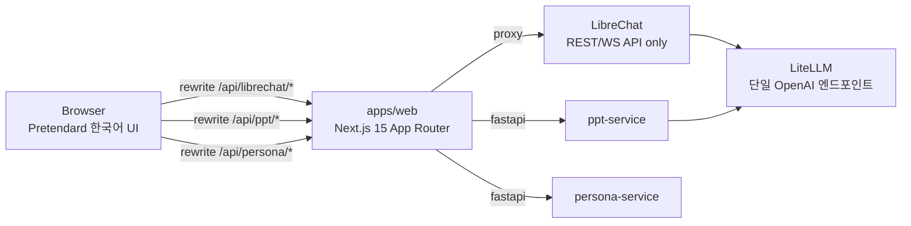
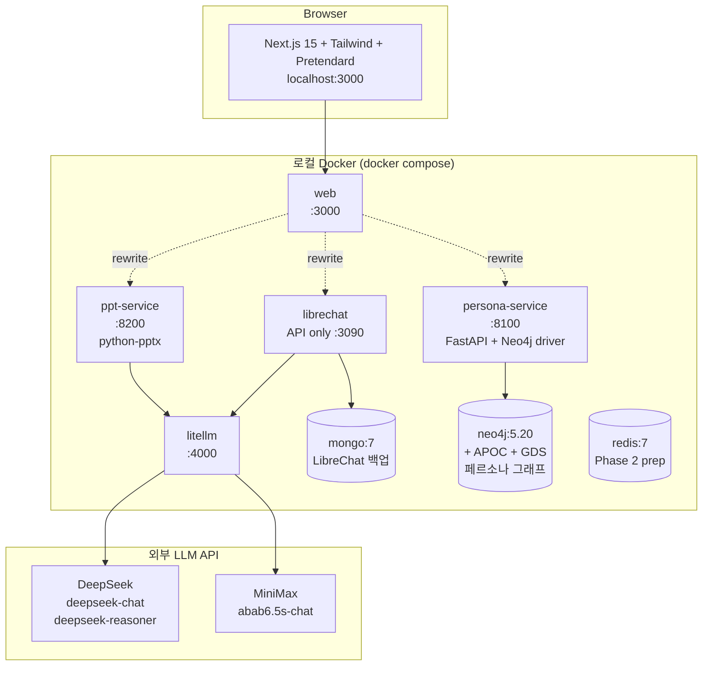
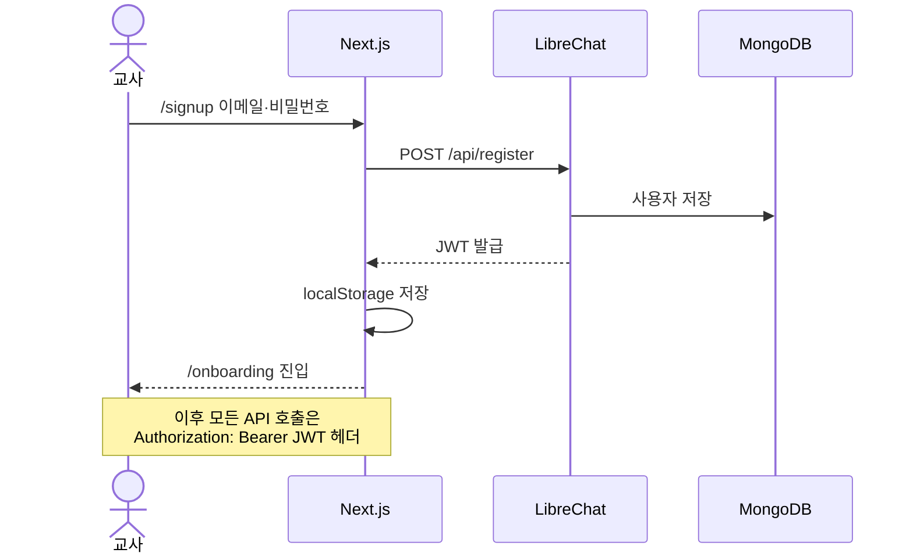
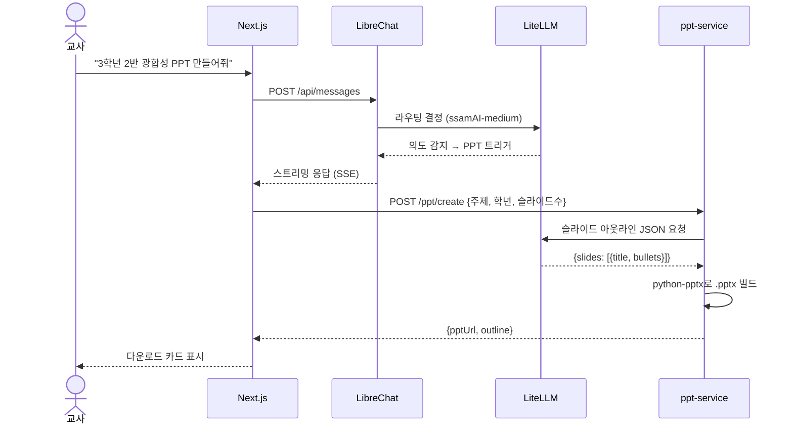
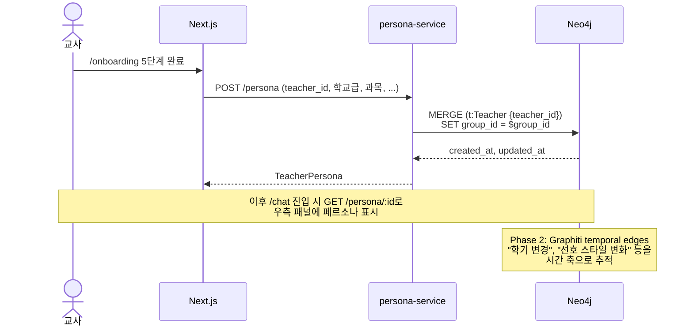
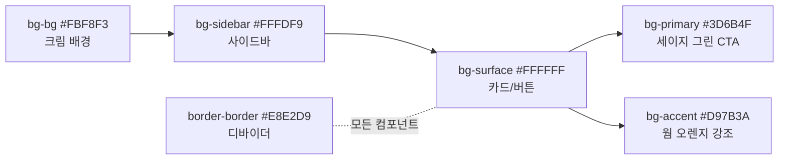

# ssamAI — 프로젝트 개요

> 한국 교원(현직 교사 + 에듀테크 직원) 특화 AI 에이전트 하네스 플랫폼
>
> Phase 1 MVP: 채팅 + .pptx 처리 + 교원 페르소나 장기 메모리

---

## 1. 무엇을 만드는가

ssamAI는 **교사 한 사람 한 사람의 수업 맥락을 기억하는 AI 에이전트**입니다. 일반 LLM 채팅이 "오늘 도와줘" 식의 단발성 대화라면, ssamAI는 **"3학년 2반 김선생님, 실험·탐구 중심 수업, 1학기 광합성 단원"** 같은 페르소나를 누적해서 다음 대화 때 그대로 이어받습니다.

핵심 사용자 두 그룹:
- **현직 교사** — 한국 학교급(초/중/고) + 과목 + 학급 상황에 맞는 수업 자료/행정 문서/Pptx를 빠르게 생성
- **에듀테크 직원** — 한국 교육 현장에 맞는 AI 기능을 자기 제품/콘텐츠에 통합하기 위한 참조 플랫폼

---

## 2. 왜 이 형태인가

### 2.1 일반 LLM이 한국 교사 현장에 못 맞는 이유

| 일반 LLM의 한계 | ssamAI의 접근 |
|---|---|
| 학년·학급·수업 철학을 매번 다시 설명해야 함 | 5단계 온보딩으로 페르소나 1회 등록 → 영구 기억 |
| "PPT 만들어줘" → 영어 자료 구조 | 한국 교육과정·교사용 어휘에 맞춘 슬라이드 구성 |
| 다양한 모델을 일일이 가입·비교해야 함 | LiteLLM 티어 라우팅으로 비용/품질 자동 배분 |
| 다른 도구(파워포인트, LMS)와 단절 | .pptx 파싱 + 생성 + 다운로드까지 한 흐름 |

### 2.2 "하네스(harness)"라는 컨셉

ssamAI는 단순한 LLM 챗봇 래퍼가 아닙니다. **에이전트가 도구·메모리·페르소나를 가지고 동작하는 인프라**입니다:

- **도구**: .pptx 생성/파싱, 교원 페르소나 CRUD, 의미적 사실 회수
- **메모리**: Neo4j 지식 그래프에 교사별 장기 기억 (멀티테넌시 격리)
- **페르소나**: 학교급·과목·수업 스타일·학급 정보를 LLM 시스템 프롬프트에 주입
- **라우팅**: LiteLLM 단일 OpenAI 호환 엔드포인트가 티어별로 모델 디스패치

---

## 3. 핵심 설계 결정

### 3.1 LLM: 단일 벤더 종속을 피하고 티어로 분리

PRD에서 처음 Claude API로 시작했지만 비용·한국어 품질을 고려해 **DeepSeek + MiniMax 듀얼 벤더**로 전환했습니다. LiteLLM이 단일 OpenAI 호환 엔드포인트로 추상화해서, 향후 Claude·Gemini 추가도 config 한 줄 변경이면 끝.

```yaml
# services/litellm/config.yaml — 티어 3개 + fallback
ssamAI-light   → MiniMax abab6.5s-chat     # 요약·파싱·단순 편집 (저비용)
ssamAI-medium  → DeepSeek-Chat              # 신규 자료 생성 (균형)
ssamAI-heavy   → DeepSeek-Reasoner          # 커리큘럼 설계·깊은 추론
fallback: heavy → medium → light
```

### 3.2 프론트엔드: LibreChat을 UI로 안 쓰고 API 서버로만 사용

LibreChat은 검증된 인증·에이전트·스트리밍 엔진을 가지고 있지만, **UI는 한국 교사용으로 직접 디자인해야** 했습니다. 그래서 LibreChat은 REST/WebSocket 백엔드로만 두고, **Next.js 15 + Pretendard**로 완전히 새로운 UI를 만들었습니다.



### 3.3 페르소나 저장소: Neo4j + 멀티테넌시

교사 페르소나는 관계형 데이터(현재 학급, 담당 과목) + 의미적 사실("3학기 동안 토론식 선호도가 올라갔어요")을 다뤄야 해서, **속성 그래프(Neo4j)**를 선택했습니다.

- **Phase 1**: 단순 CRUD (`Teacher` 노드 + `teacher_id` MERGE)
- **Phase 2**: Graphiti 풀 스택으로 temporal edges + 의미 검색 추가
- **멀티테넌시**: 모든 Cypher 쿼리에 `WHERE n.group_id = $group_id` 필터 → 다른 교사 데이터 누설 차단

### 3.4 디자인 시스템: 한국 교실에서 자연스러운 톤

Tailwind 토큰을 단일 진실로 두고, 와이어프레임(`ssamAI_wireframe_v2.jsx`)의 팔레트를 그대로 가져왔습니다. hex를 컴포넌트에 직접 쓰는 건 금지.

| 토큰 | HEX | 의미 |
|---|---|---|
| `bg-bg` | `#FBF8F3` | 앱 배경 — 크림(교과서 종이) |
| `bg-primary` | `#3D6B4F` | 세이지 그린 — 차분하고 교육적인 CTA |
| `bg-accent` | `#D97B3A` | 웜 오렌지 — 강조/배지 |
| `border-border` | `#E8E2D9` | 부드러운 디바이더 |

폰트는 `Pretendard` (CDN) → `Apple SD Gothic Neo` fallback. 한국어 가독성 최우선.

---

## 4. 시스템 아키텍처

전체 8개 서비스를 docker compose로 한 번에 띄웁니다. Phase 1은 외부 의존성 4개 (DeepSeek, MiniMax API + 사용자 local docker)만 있으면 됩니다.



**포트 매트릭스** (모두 `${VAR:-default}` 패턴으로 override 가능):

| 서비스 | 내부 → 호스트 | 비고 |
|---|---|---|
| web | 3000 → 3000 | `WEB_PORT` |
| librechat | 3080 → 3090 | `LIBRECHAT_PORT` |
| litellm | 4000 → 4000 | `LITELLM_PORT` |
| ppt-service | 8200 → 8200 | `PPT_SERVICE_PORT` |
| persona-service | 8100 → 8100 | `PERSONA_SERVICE_PORT` |
| neo4j browser | 7474 → 7474 | 고정 |
| neo4j bolt | 7687 → 7687 | driver |
| mongo | 27017 → 27017 | root 계정 env 필수 |
| redis | 6379 → 6379 | Phase 2 prep |

---

## 5. 핵심 데이터 흐름 3가지

### 5.1 회원가입 / 로그인



**왜 localStorage?** Phase 1 단순화. Phase 2에서 httpOnly + SameSite 쿠키로 마이그레이션 예정 (XSS surface 제거).

### 5.2 PPT 생성



**LiteLLM 티어 선택**: PPT outline 같은 신규 자료 생성은 `ssamAI-medium` (DeepSeek-Chat). 비용/품질 균형. 단순 파싱/요약은 `ssamAI-light` (MiniMax).

### 5.3 페르소나 장기 기억



**멀티테넌시 격리**: 모든 Cypher는 `WHERE t.group_id = $group_id` 필수. `GRAPHITI_GROUP_ID` env 기본값 `default-teacher-group`.

---

## 6. 기술 스택 요약

| 영역 | 선택 | 이유 |
|---|---|---|
| **프론트엔드** | Next.js 15 (App Router) + React 19 RC + Tailwind | SSR + 한국어 SEO, 타입 안전 라우팅 |
| **인증/채팅 엔진** | LibreChat (API only) | 검증된 JWT + 스트리밍 + 대화 관리 |
| **LLM 라우터** | LiteLLM | 멀티 벤더 단일 엔드포인트 추상화 |
| **LLM — 경량** | MiniMax abab6.5s-chat | 한국어 품질, 저비용 |
| **LLM — 중형** | DeepSeek-Chat | 균형 (비용/품질), 자료 생성용 |
| **LLM — 대형** | DeepSeek-Reasoner | 추론, 커리큘럼 설계 |
| **PPT 처리** | python-pptx | .pptx 파일 직접 빌드/파싱 |
| **페르소나 저장** | Neo4j 5.20 + APOC + GDS | 속성 그래프 → Phase 2 Graphiti |
| **인증 저장** | MongoDB 7 | LibreChat 백업 |
| **캐시** | Redis 7 | Phase 2 prep (현재 미사용) |
| **컨테이너** | Docker Compose v2 | 로컬 dev / Phase 3 단일 노드 배포 |
| **런타임** | Python 3.11+ (FastAPI) / Node.js 20+ (Next.js) | — |

---

## 7. 디자인 시스템 (Tailwind 토큰)



**폰트 스택**: `Pretendard` (CDN) → `Apple SD Gothic Neo` → `system-ui` → `sans-serif`

**컨벤션**:
- 컴포넌트에서 hex 직접 사용 금지 — `tailwind.config.ts`의 토큰만 참조
- 새 색상 추가 시 와이어프레임(`ssamAI_wireframe_v2.jsx`)에 먼저 등록 후 토큰화

---

## 8. Phase 로드맵

```mermaid
gantt
  title ssamAI Phase 로드맵
  dateFormat YYYY-MM
  section Phase 1 (현재)
    채팅 (Next.js + LibreChat)    :done, p1a, 2025-12, 2026-06
    .pptx 파싱/생성               :done, p1b, 2025-12, 2026-06
    페르소나 온보딩 (5단계)        :done, p1c, 2025-12, 2026-06
  section Phase 2
    LiteLLM 멀티 라우팅 고도화     :p2a, 2026-07, 2M
    .hwp / .hwpx 처리              :p2b, 2026-08, 2M
    커뮤니티 피드 + DM             :p2c, 2026-09, 3M
  section Phase 3
    학교 기관 구독                  :p3a, 2027-Q1, 3M
    Co-Edit (Yjs)                  :p3b, 2027-Q2, 3M
    MCP 기반 NEIS·에듀넷 연동      :p3c, 2027-Q3, 3M
    모바일 앱                       :p3d, 2027-Q4, 3M
```

---

## 9. 알려진 기술 부채 (Phase 1 한정)

| 항목 | 현재 | 마이그레이션 |
|---|---|---|
| JWT 저장 | localStorage (XSS 노출) | httpOnly + SameSite 쿠키 (Phase 2) |
| CORS | `allow_origins=["*"]` | 도메인 화이트리스트 (프로덕션 전) |
| Graphiti | 단순 property CRUD | temporal edges + 의미 검색 (Phase 2) |
| PPT 저장 | 로컬 `/tmp/ssamAI-ppt-output` | NCloud Object Storage (Phase 3) |
| LLM JSON 검증 | 부재 (raw 신뢰) | Pydantic 검증 추가 (기술 부채 §5.5) |
| 로그/모니터링 | Docker stdout만 | OpenTelemetry (Phase 2) |

---

## 10. 디렉터리 구조

```
ssamAI/
├── apps/
│   ├── web/                    # Next.js 15 — 메인 프론트엔드 (포트 3000)
│   │   ├── app/                # App Router 페이지·레이아웃
│   │   ├── components/         # UI 컴포넌트 (와이어프레임 기반)
│   │   ├── lib/                # api-client, auth, colors, sse, types
│   │   ├── public/             # favicon, 정적 자산
│   │   └── Dockerfile          # 멀티스테이지 standalone 빌드
│   └── librechat/              # LibreChat config (UI는 web, 여기는 API only)
├── services/
│   ├── ppt-service/            # FastAPI + python-pptx (포트 8200)
│   ├── persona-service/        # FastAPI + Neo4j + Graphiti (포트 8100)
│   └── litellm/                # LiteLLM config (model_list + fallback)
├── docs/                       # 공유용 문서 (이 파일 포함)
├── docker-compose.yml          # 전체 8서비스 인프라 정의
├── ARCHITECTURE.md             # 상세 아키텍처 (포트 매트릭스·데이터 흐름)
└── README.md                   # 빠른 시작
```

---

## 11. 빠르게 시작하기

```bash
# 1) 환경변수
cp .env.example .env
# .env에서 DEEPSEEK_API_KEY, MINIMAX_API_KEY 채우기
# CREDS_KEY, JWT_SECRET, JWT_REFRESH_SECRET, LITELLM_MASTER_KEY 생성
openssl rand -base64 32  # 4번 반복

# 2) 전체 스택 실행
docker compose up -d --build   # 첫 빌드 ~5분

# 3) 접속
# http://localhost:3000      ssamAI 웹앱
# http://localhost:3090      LibreChat API
# http://localhost:4000      LiteLLM
# http://localhost:7474      Neo4j Browser
# http://localhost:8200/docs ppt-service OpenAPI
# http://localhost:8100/docs persona-service OpenAPI

# 4) 회원가입 → /onboarding 5단계 → /chat
```

---

## 12. 기여 가이드

코드 변경 시 다음을 먼저 읽으세요:
- `AGENTS.md` (root) — 모든 AI 코딩 에이전트 공통 규칙
- `ARCHITECTURE.md` — 상세 아키텍처 결정
- `.harness/docs/pitfalls.md` — 13개 알려진 함정

**PR 전 필수**: `pnpm typecheck && pnpm lint && ruff check services/<name>` 모두 통과.

---

## 라이선스

UBION Co., Ltd. — 기밀 (Confidential).